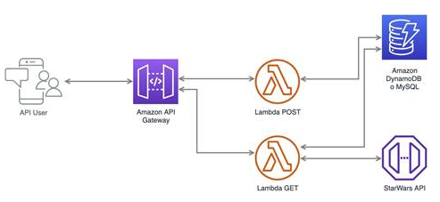

> ### AWS DynamoDB + Lambda test api SWAPI 

Simple proyecto que visualiza/guarda/consulta guardados  personajes de starwars SWAPI

# Instrucciones


## Inicia el server local

```
npm install
npm run start
```

Inicia DynamoDB emulador offline. Usa api calls con url base: `http://localhost:3000/api` asi:

1. Consulta personajes disponibles en swapi por paginacion:  [GET]

```
  http://localhost:3000/api/people/page/4
```

2. Escoje un personaje y guardalo en dynamo (no permite guardar repetidos y la data debe de incluir url de origin de manera obligatoria) enviandolo a :  [POST]

```
  http://localhost:3000/api/save

```
  body: 

```
  {
    "name": "Qui-Gon Jinn", 
    "height": "193", 
    "mass": "89", 
    "hair_color": "brown", 
    "skin_color": "fair", 
    "eye_color": "blue", 
    "birth_year": "92BBY", 
    "gender": "male", 
    "homeworld": "https://swapi.py4e.com/api/planets/28/", 
    "films": [
        "https://swapi.py4e.com/api/films/4/"
    ], 
    "species": [
        "https://swapi.py4e.com/api/species/1/"
    ], 
    "vehicles": [
        "https://swapi.py4e.com/api/vehicles/38/"
    ], 
    "starships": [], 
    "created": "2014-12-19T16:54:53.618000Z", 
    "edited": "2014-12-20T21:17:50.375000Z", 
    "url": "https://swapi.py4e.com/api/people/32/"
 }

```
3. Consulta los personajes guardados con campos en espanol: [GET]

```
  http://localhost:3000/api/people/saved/
```

  response:

```
{
  "allRecords": {
    "Items": [
      {
        "color_cabello": "brown",
        "color_piel": "fair",
        "peso": "89",
        "peliculas": [
          "https://swapi.py4e.com/api/films/4/"
        ],
        "naves": [],
        "nombre": "Qui-Gon Jinn",
        "vehiculos": [
          "https://swapi.py4e.com/api/vehicles/38/"
        ],
        "url": "https://swapi.py4e.com/api/people/32/",
        "color_ojo": "blue",
        "nacimiento": "92BBY",
        "especie": [
          "https://swapi.py4e.com/api/species/1/"
        ],
        "creado": "2014-12-19T16:54:53.618000Z",
        "altura": "193",
        "editado": "2014-12-20T21:17:50.375000Z",
        "genero": "male",
        "id": "2c1e6906-01ee-46f2-94eb-a0d2d8c2683a",
        "mundo_origen": "https://swapi.py4e.com/api/planets/28/"
      },
      ...
    ],
    "Count": 1,
    "ScannedCount": 1
  }
}

```


## Test local
```
npm test
```
## Estructura



## Deploy
```
npm run deploy
```
